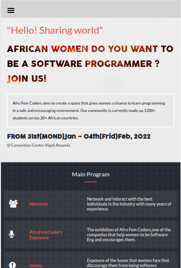
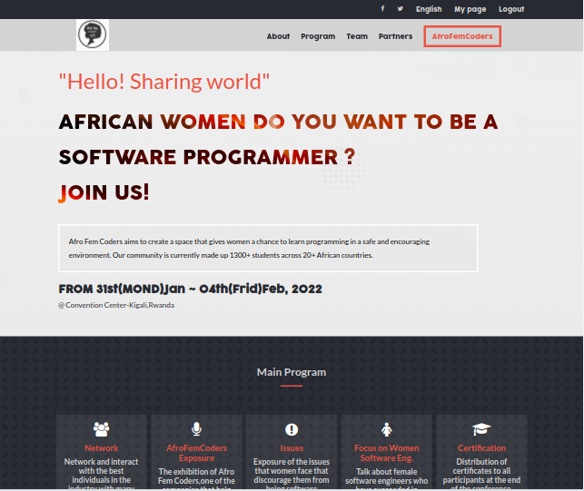

# AFRICAN WOMEN SOFTWARE ENGINEERS

## Description
African Women Software Engineers is a website for a software development company that helps women to learn to program and become software engineers. And in this website, I talk about Afro Fem Coders
Afro Fem Coders aims to create a space that gives women a chance to learn programming in a safe and encouraging environment. Our community is currently made up of 1300+ students across 20+ African countries.

- This is the page view:

> || Mobile version | Desktop version||
> |-|---------|-----------|-|
>||   |  |

> Learning Objectives

- Use semantic HTML tags.
- Apply best practices in HTML code.
- Use CSS box model.
- Use CSS selectors correctly.
- Use Flexbox to place elements in the page.
- Demonstrate ability to create UIs adaptable to different screen - sizes using media queries.
- Use GitHub Pages to deploy web pages.
- Apply JavaScript best practices and language style guides in code.
- Use JavaScript to manipulate DOM elements.
- Use JavaScript events.
- Use objects to store and access data.
- Communicate technical concepts to other technical people.
- Build the capstone project site.

## Built With

- HTML
- CSS (Flexbox and Grid)
- JavaScript
- Git and GitHub

## Live Demo

[Live Demo Link](https://cynthiainga.github.io/Capstone-Proj-1/)

## Zoom Video

[Link Zoom](https://drive.google.com/file/d/1Et6QWO7fPRXX_MJxCug3pD-Ov0snr9l_/view?usp=sharing)

## Getting Started

To get a local copy for this project and running follow these simple example steps.

### Prerequisites

- You need to have git installed in your computer
- A text editor or terminal
- A web brower to view output

### Setup

- To clone the repository run this command `git clone https://github.com/cynthiainga/Capstone-Proj-1.git`

### Run tests

For tracking linters errors locally you need to follow these steps:

- After cloning the project you need to run this command
  > npm install
   `This command will download all the dependencies of the project`

- For tracking the linter errors in HTML file run:
  > npx hint .

- For tracking the linter errors in CSS file run:
  > npx stylelint "**/*.{css,scss}"

  - And For tracking the linter errors in JavaScript file run:
  > npx eslint .

### Deployment

- I used GitHub Pages to deploy my website 
- For more information about publishing sources, see "[About github page](https://docs.github.com/en/pages/getting-started-with-github-pages/about-github-pages#publishing-sources-for-github-pages-sites)"

## Author

👤 **Cynthia Inga Candy**

- GitHub: [@cynthiainga](https://github.com/cynthiainga)
- Twitter: [@CynthiaInga_C](https://twitter.com/CynthiaInga_C)
- LinkedIn: [Cynthia Inga](https://www.linkedin.com/in/cynthia-inga7/)

## 🤝 Contributing

Contributions, issues, and feature requests are welcome!

Feel free to check the [issues page](../../issues/).

## Show your support

Give a ⭐️ if you like this project!

## Acknowledgments

- Design and inspiration by [Cindy Shin on Behance](https://www.behance.net/gallery/29845175/CC-Global-Summit-2015).

- Hat tip to [Microvers](www.microverse.org)  and all the staff
- Thanks to My coding Partners 
- Thanks to My Morning-session-group and Standup-team Partners and
- Thanks to Code Reviewers

## 📝 License

This project is [MIT](./MIT.md) licensed.
